# Zero DCE

[](https://paperswithcode.com/sota/low-light-image-enhancement-on-dicm?p=zero-reference-deep-curve-estimation-for-low)
[](https://paperswithcode.com/sota/low-light-image-enhancement-on-lime?p=zero-reference-deep-curve-estimation-for-low)
[](https://paperswithcode.com/sota/low-light-image-enhancement-on-mef?p=zero-reference-deep-curve-estimation-for-low)
[](https://paperswithcode.com/sota/low-light-image-enhancement-on-npe?p=zero-reference-deep-curve-estimation-for-low)
[](https://paperswithcode.com/sota/low-light-image-enhancement-on-vv?p=zero-reference-deep-curve-estimation-for-low)

Pytorch implementation of Zero-Reference Deep Curve Estimation for Low-Light Image Enhancement ([https://arxiv.org/abs/2001.06826](https://arxiv.org/abs/2001.06826)).


**Access Notebooks using Binder:** [](https://mybinder.org/v2/gh/soumik12345/Zero-DCE/HEAD)

**Find Training Logs on Wandb:** [https://wandb.ai/19soumik-rakshit96/zero-dce](https://wandb.ai/19soumik-rakshit96/zero-dce)

## Results

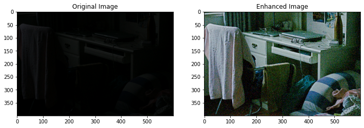

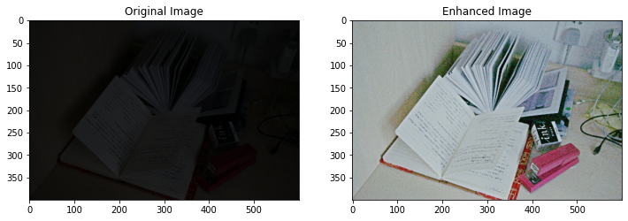

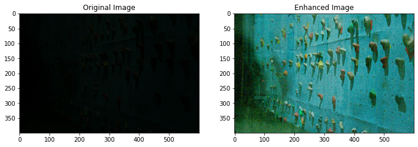

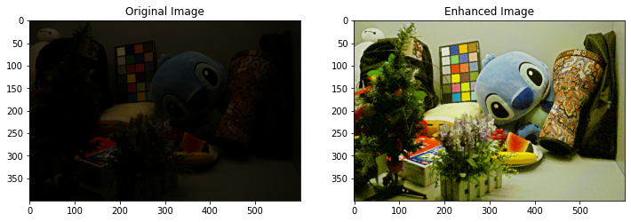

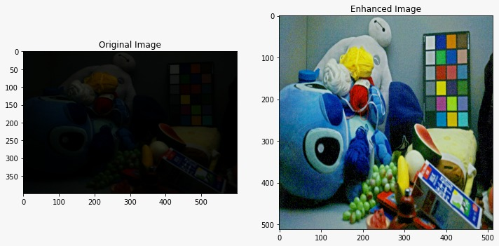

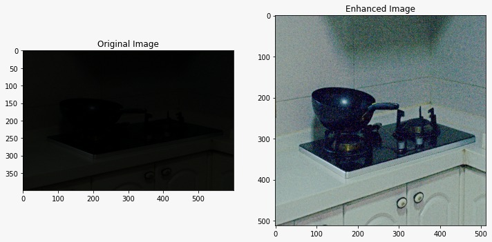

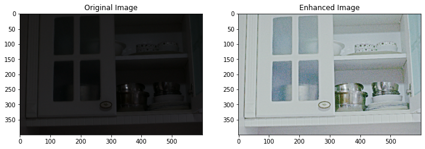

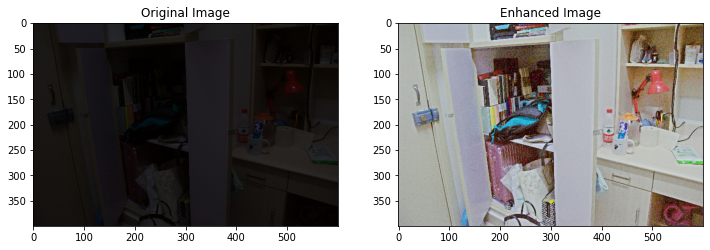

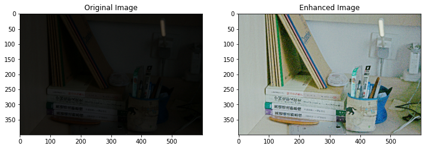

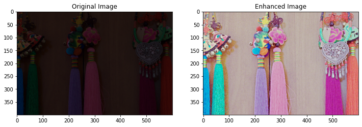

## Examples of Noisy Results

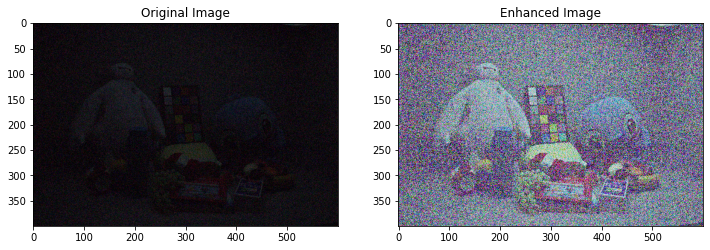

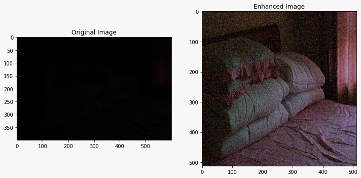

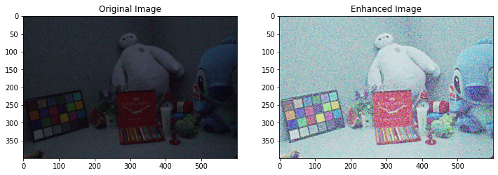

## Citation

```
@article{2001.06826,
    Author = {Chunle Guo and Chongyi Li and Jichang Guo and Chen Change Loy and Junhui Hou and Sam Kwong and Runmin Cong},
    Title = {Zero-Reference Deep Curve Estimation for Low-Light Image Enhancement},
    Year = {2020},
    Eprint = {arXiv:2001.06826},
    Howpublished = {CVPR 2020},
}
```
